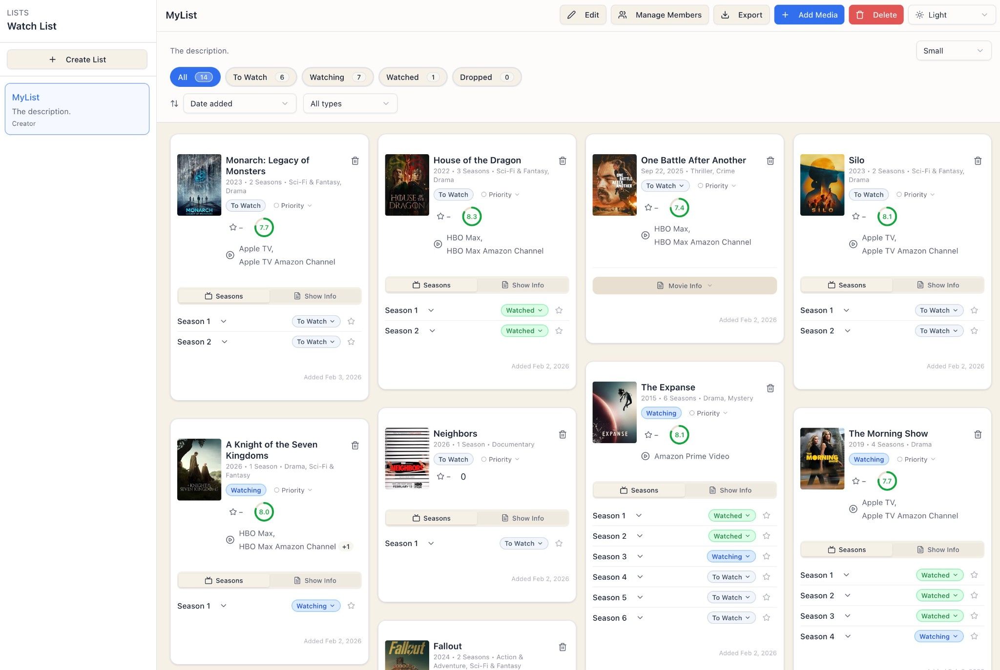
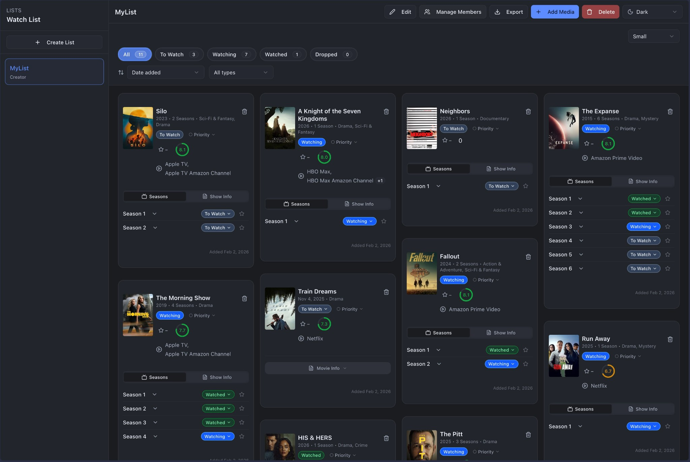

# 🎬 Watch List

A full-stack web application for tracking movies and TV shows across personal and shared lists. Built with Next.js, Convex, and Clerk, the app supports authenticated collaboration, role-based permissions, structured media tracking, and real-time updates across lists and viewing progress. It also serves as a portfolio project demonstrating full-stack architecture, validation, access control, and collaborative data modeling.


*Light theme interface*


*Dark theme interface*

## ✨ Features

### 📋 List Management
- **Multiple Lists**: Create and organize multiple watch lists
- **Role-Based Collaboration**: Share lists with friends and manage member permissions (Creator, Admin, Viewer)
- **Custom Descriptions**: Add descriptions and customize list settings
- **Export**: Export your lists to CSV format

### 🎯 Media Tracking
- **Status Management**: Track media as "To Watch", "Watching", "Watched", or "Dropped"
- **TV Show Season Tracking**: Track individual seasons with their own status, ratings, and notes
- **Ratings**: Rate movies and TV shows (1-10 scale)
- **Priority Levels**: Mark items as Low, Medium, or High priority
- **Notes & Tags**: Add personal notes and tags to any media item
- **Date Tracking**: Track when you started and finished watching content

### 🔍 Search & Discovery
- **TMDB Integration**: Search and add movies/TV shows using The Movie Database API
- **Rich Media Data**: Automatically fetches posters, descriptions, genres, ratings, and streaming providers
- **Smart Caching**: Search results are cached to reduce API calls

### 🎨 User Experience
- **Light/Dark Theme**: Toggle between light and dark themes
- **Responsive Design**: Works seamlessly on desktop and mobile devices
- **Card Sizes**: Choose between small and regular card sizes
- **Filtering & Sorting**: Filter by status, type (movie/TV), and sort by date added, release date, rating, or alphabetically
- **Masonry Layout**: Beautiful grid layout that adapts to content

### 🔐 Authentication & Security
- **Clerk Authentication**: Secure user authentication and management
- **User Profiles**: Automatic user profile sync from Clerk
- **Protected Routes**: Secure access to user-specific data

## 🛠️ Tech Stack

### Frontend
- **Next.js 16** - React framework with App Router
- **React 19** - UI library
- **TypeScript** - Type safety
- **Tailwind CSS** - Styling
- **Radix UI** - Accessible component primitives
- **Lucide React** - Icons

### Backend
- **Convex** - Real-time backend with automatic API generation
- **Clerk** - Authentication and user management
- **TMDB API** - Movie and TV show data

### DevOps & Monitoring
- **Vercel** - Hosting and deployment
- **Sentry** - Error tracking and monitoring
- **ESLint** - Code quality

## Architecture Overview

This project uses a Next.js App Router frontend with Convex as the backend layer for database access, business logic, and real-time updates. Clerk handles authentication, while TMDB provides external media data that is cached and normalized for app use.

Core architecture decisions:
- **Frontend:** Next.js renders the dashboard, list views, media cards, and management flows
- **Backend:** Convex queries and mutations handle list management, permissions, media state, and collaborative updates
- **Authentication:** Clerk manages sign-in, sessions, and protected routes
- **Authorization:** list-level role checks control who can view, edit, manage members, or administer shared lists
- **Data model:** media metadata is stored separately from list-specific tracking state, allowing reuse across multiple lists
- **External APIs:** TMDB powers search and media metadata, with caching to reduce unnecessary requests

This architecture keeps the app responsive and collaborative while centralizing business logic in the backend.

## 🚀 Getting Started

### Prerequisites

- Node.js 20+ and npm
- Accounts for:
  - [Convex](https://www.convex.dev/)
  - [Clerk](https://clerk.com/)
  - [TMDB](https://www.themoviedb.org/) (free API key)

### Installation

1. **Clone the repository**
   ```bash
   git clone https://github.com/rkadlick/watch-list.git
   cd watch-list
   ```

2. **Install dependencies**
   ```bash
   npm install
   ```

3. **Set up environment variables**
   ```bash
   cp .env.example .env.local
   ```

4. **Configure environment variables**
   
   Edit `.env.local` and add your credentials:

   | Variable | Description | Where to Get It |
   |----------|-------------|-----------------|
   | `NEXT_PUBLIC_CONVEX_URL` | Convex deployment URL | Convex Dashboard → Settings |
   | `CONVEX_DEPLOYMENT` | Convex deployment ID | Convex Dashboard → Settings |
   | `CLERK_PUBLISHABLE_KEY` | Clerk publishable key | Clerk Dashboard → API Keys |
   | `CLERK_JWT_ISSUER_DOMAIN` | Clerk JWT issuer domain | Clerk Dashboard → API Keys |
   | `TMDB_API_KEY` | TMDB API key | [TMDB Settings](https://www.themoviedb.org/settings/api) |

   **Optional variables:**
   - `CLERK_SECRET_KEY` - Required for webhook user syncing
   - `NEXT_PUBLIC_CLERK_PUBLISHABLE_KEY` - Client-side Clerk SDK
   - `CLERK_WEBHOOK_SECRET` - For Clerk webhooks
   - `SENTRY_DSN` - For error monitoring

5. **Set up Convex**
   ```bash
   npx convex dev
   ```
   This will create your Convex project and sync the schema.

6. **Run the development server**
   ```bash
   npm run dev
   ```

7. **Open your browser**
   Navigate to [http://localhost:3000](http://localhost:3000)

## 📖 Usage

1. **Sign Up / Sign In**: Create an account or sign in with Clerk
2. **Create a List**: Click "+ Create List" in the sidebar
3. **Add Media**: Click "+ Add Media" and search for movies or TV shows
4. **Track Progress**: Update status, add ratings, notes, and track seasons
5. **Share Lists**: Use "Manage Members" to invite friends to your lists
6. **Export**: Export your lists to CSV for backup or sharing

## 🚢 Deployment

See [DEPLOYMENT.md](./DEPLOYMENT.md) for detailed deployment instructions.

### Quick Deploy to Vercel

1. Push your code to GitHub
2. Import the repository in [Vercel](https://vercel.com/new)
3. Add environment variables in Vercel dashboard
4. Deploy!

## 📁 Project Structure

```
watch-list/
├── app/                    # Next.js App Router pages
│   ├── api/               # API routes (webhooks)
│   ├── dashboard/         # Main dashboard page
│   └── layout.tsx         # Root layout
├── components/            # React components
│   ├── media-card/        # Media card components
│   └── ui/                # Reusable UI components
├── convex/                # Convex backend functions
│   ├── lists.ts           # List management
│   ├── media.ts           # Media data fetching
│   ├── users.ts           # User management
│   └── schema.ts          # Database schema
├── lib/                   # Utility functions
├── docs/                  # Documentation and images
└── public/                # Static assets
```

## 🔒 Security and Validation

- Authentication handled by Clerk
- Protected routes enforced with middleware
- Role-based access control for shared list actions
- Shared validation layer for ratings, dates, tags, and sanitized text input
- Sensitive credentials stored in environment variables
- Error monitoring and runtime visibility via Sentry
 
## Tradeoffs and Future Improvements

This project was built to balance product usability with a relatively lean architecture. Convex keeps the backend simple and real-time, but it also means permission and business-rule checks need to be consistently enforced across mutations rather than through a separate API/service layer.

Areas I would improve next:
- add automated tests for key backend mutations and critical UI flows
- introduce stronger structured error types and recovery patterns
- add collaborative activity history for shared list changes
- expand analytics around watch trends and list usage

## 📝 License

This project is open source and available under the [MIT License](LICENSE).

## 🙏 Acknowledgments

- [The Movie Database (TMDB)](https://www.themoviedb.org/) for media data
- [Convex](https://www.convex.dev/) for the backend platform
- [Clerk](https://clerk.com/) for authentication
- [Next.js](https://nextjs.org/) team for the amazing framework

---

Built with ❤️ using Next.js, Convex, and Clerk
